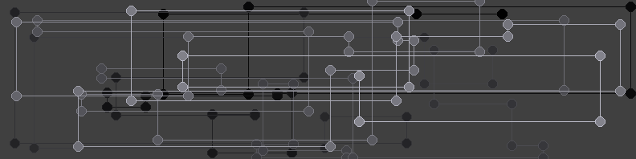

# Nodelines
## Summary
The original purpose of nodelines was to make LinkedIn profile backgrounds. Each version basically makes a line with connected segments. Each segment has a circle and fill drawn where it connects to another segment giving the appearance of a node. Most versions ask for RGB colors for the foreground and background. The Nodelines03.ps1 uses a more elaborate color system where numerous colors can be specified.
## Requirements
* Powershell
* .Net framework for the Drawing Assembly (Need to determine whether that is core or full.)
* A folder to store artifacts. c:\temp\nodelines will be created by default.
* The color_functions.ps1 file should be in the same folder as the nodelines03.ps1 script.
## Usage
1. Set the size and color variables at the beginning of each script.
2. Run the script from a powershell console or VSCode (Note: Powershell CLI needs to be tested).
## Examples
Nodelines01.ps1

Nodelines02.ps1

Nodelines03.ps1

Nodelines04.ps1

Nodelines04.ps1

Nodelines04.ps1

Nodelines04.ps1

## Future Enhancements
- Create some more ordered options.
- Test with Powershell CLI.
- Test on MacOS and Linux with Powershell.
- Create some animation options for movie making.